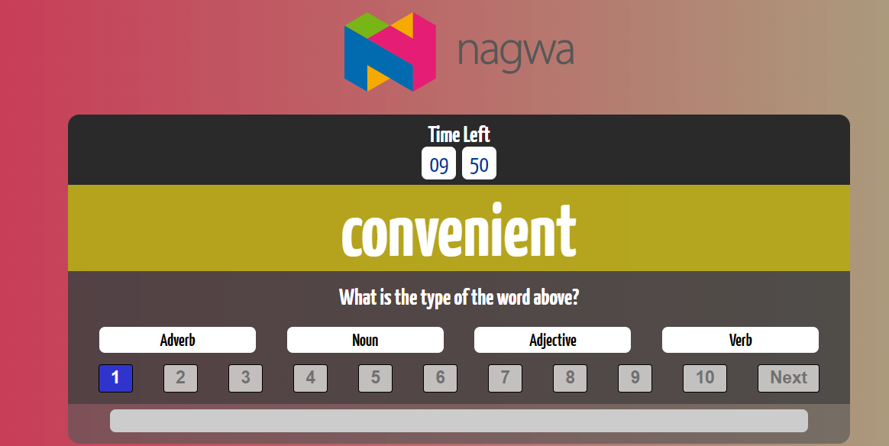
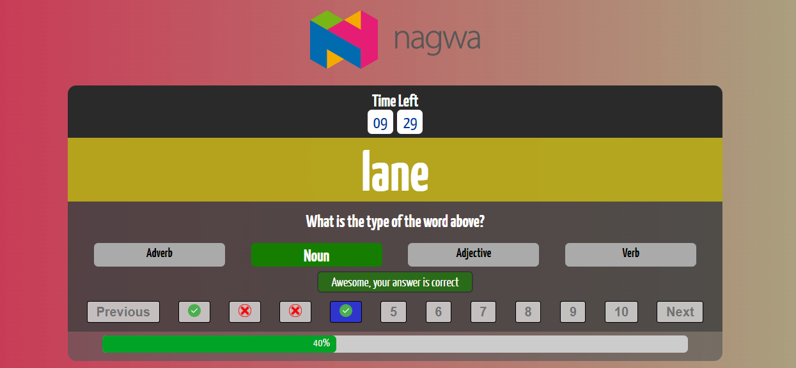
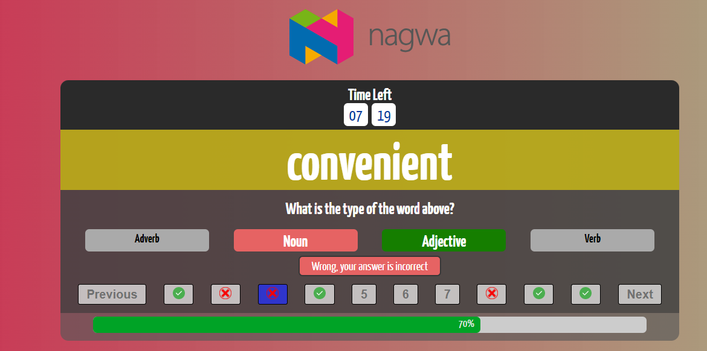
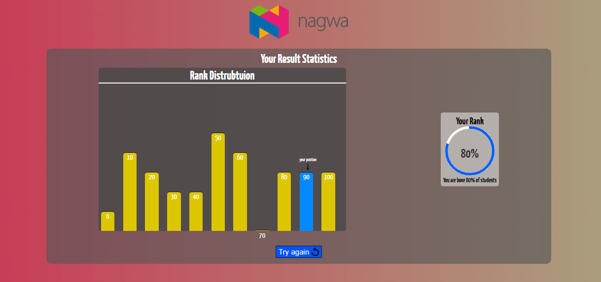

# Words Categorization App

### This app is developed for Nagwa cooding test.
## About:
### This app test your skills in english words, and how well you know adverb,adjective etc... 
### There is a timer for the quiz which is 10 min . 
### after you finsh the 10 questions you get your rank  among about 30 students' degree.
## Requirements :
### you should have node in your machine.
## Language :  
### TypeScript 


## Tools : 
- React (Front-End)
- Node.JS (Back-End)
- Express.jS (Back-End)
## Steps
 ### 0 - you need to clone this repo in your machine 
 ```
    git clone https://github.com/Mans1611/Nagwa-Project
 ``` 

 ### 1 - install server dependencies : 
 ```
    cd server && npm install && cd ..
 ``` 
 ### 2 - install client dependencies : 
 ```
    cd client && npm install && cd .. 
 ``` 
 ### 3 - run server first 
 ```
    cd server && npm run start 
 ``` 

### Open new terminal 
 ### 4 - run client  
 ```
    cd client && npm run start 
 ``` 

## Additional Features : 
- Time counter 10 min.
- Question indexes, let the student nav to any question.
- simple chart to show distrubution.








#### Author : Mansour Moahmed


